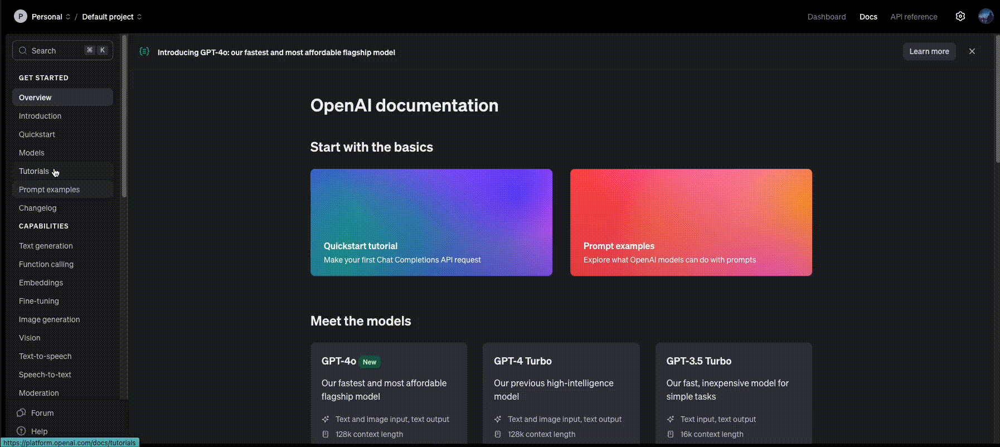

# Super-side GraphRAG

## Description

This project is a Python application that uses FastAPI, MongoDB and openai API(s) to implement a chat app (GraphRAG). It provides a RESTful API for managing login, sign-up, selecting an expert brand agent, creating threads and messages.

## Index
- [Description](#description)
- [Feature](#features)
- [Technologies and Frameworks](#technologies-and-frameworks)
- [Prerequisites](#prerequisites)
- [App File and Folder Structure](#app-file-and-folder-structure)
- [Setup](#setup)
- [Configuration](#configuration)
- [Running it locally](#running-the-application)
- [Example showing creation of Agent](#ex)


## Features
- Login
- Sign-up using a secret token (Protection against bots)
- Chat History
- RAG system based on OPENAI's Assistant API and [Playground](https://platform.openai.com/playground/assistants)
- SSL for transport layer security 
- JWT token and password hashing
- RESTAPI endpoints for figma integration available at route (`/docs`)


## Technologies and Frameworks
- Python3.10
- MongoDB 7
- OPENAI API
- Docker
- Docker Compose
- FastAPI
- Flowbite UI components
- VanillaJS


## Prerequisites
- Docker and Docker Compose


## App File and Folder Structure
```
app
├── core
│   ├── __init__.py
│   ├── config.py
│   ├── database.py
│   └── openai_client.py
├── dependencies
│   ├── __init__.py
│   └── auth.py
├── main.py
├── models
│   ├── __init__.py
│   ├── base.py
│   ├── message.py
│   ├── thread.py
│   └── user.py
├── routes
│   ├── __init__.py
│   ├── assistant.py
│   ├── auth.py
│   ├── message.py
│   ├── router.py
│   ├── thread.py
│   └── user.py
├── schemas
│   ├── __init__.py
│   ├── assistant.py
│   ├── auth.py
│   ├── base.py
│   ├── message.py
│   ├── thread.py
│   └── user.py
├── services
│   ├── __init__.py
│   ├── assistant.py
│   ├── auth.py
│   ├── message.py
│   ├── thread.py
│   └── user.py
└── utils
    ├── __init__.py
    └── auth.py
```

## Setup

1. Clone the repository:
    ```bash
    git clone https://github.com/waynetech/superside-assignment.git
    ```

2. Navigate to the project directory:
    ```bash
    cd superside-assignment
    ```

3. Place the `.env` file provided in the mail under `superside-assignment` folder:
    ```bash
    cp /path/to/.env superside-assignment
    ```


## Configuration

This project uses environment variables for configuration. These are stored in a `.env` file. You will need to place the `.env` file provided in mail in the root directory of the project. Here is a basic example:

```properties
DATABASE_URL=mongodb://127.0.0.1:27017/superside_db
ACCESS_TOKEN_EXPIRE_MINUTES=60
REFRESH_TOKEN_EXPIRE_MINUTES=10080
ALGORITHM="HS256"
JWT_SECRET_KEY="supersecretkey"
JWT_REFRESH_SECRET_KEY="supersupersecretkey"
BOT_PROTECTION_SECRET=botsecretkey
OPENAI_API_KEY=openai-api-key
```

## Running the Application

1. To build the webapp (assuming docker and docker compose is already installed in the system). Depending on the system you can use `docker-compose`(mac) or `docker compose`(Ubuntu 24.04). Run
```bash
docker-compose build --no-cache
```

2. To run the application, use the following command:

```bash
docker-compose up
```

3. For sign up, a secret code is provided in mail and can be found under `.env` file.

This will start the FastAPI application with hot-reloading enabled. The app will be running on [http://127.0.0.1:9000](http://127.0.0.1:9000)


## Example showing creation of Agent


1. Log on to [OpenAI Playground](https://platform.openai.com/playground/assistants)

2. Click on `create assistant` and give it a name `Burger King`

3. Add instructions
```
You are a AI-first brand system, GraphRAG, will leverage the power of large language models (LLMs) and knowledge graphs to centralize all brand information in a user-friendly, model-agnostic platform. This innovative approach aims to:
● Reduce brand guideline misuse
● Accelerate access to brand knowledge for creatives
● Enable precise retrieval of brand information
● Alleviate the stress on creatives by simplifying prompt engineering
With GraphRAG, any creative can interact with an LLM-based chatbot to receive accurate, real-time information on brand guidelines and design systems, thereby freeing up their time for more creative tasks.

You are an expert in following the brand guidelines and always reply with information retrieved from the pdf.  Don't mention sources, page number to file. Always search the file, before you reply
```

4. Enable the `file search` feature and use `+` button to add brand guideline files to vector store

5. This will automattically save the agent and it will show up on chat 